# Secalender 時間引擎架構 — Mermaid 圖

本文件以 Mermaid 圖呈現 [TIME_ENGINE_ARCHITECTURE.md](./TIME_ENGINE_ARCHITECTURE.md) 中的架構。

---

## 1. 整體定位

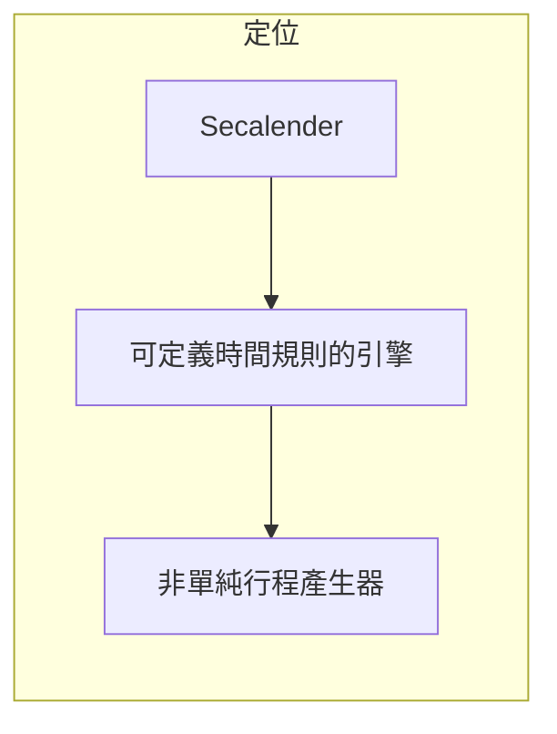

---

## 2. 時間規劃的 7 大型態

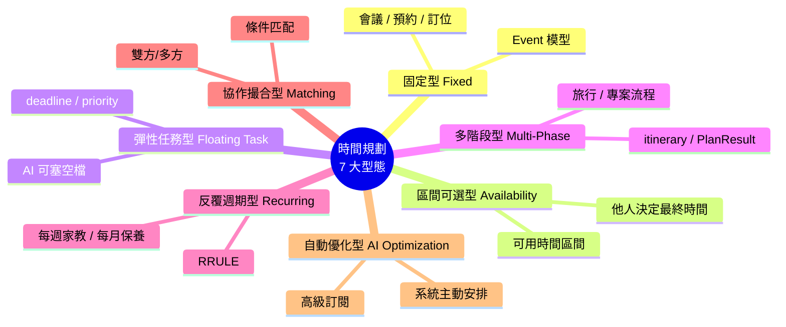

---

## 3. 時間規劃三維度

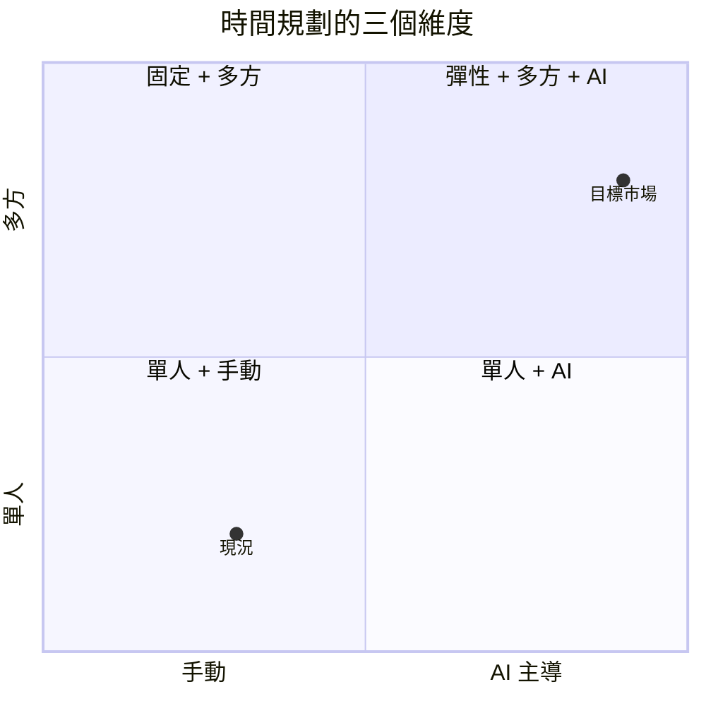

簡化版（維度與選項）：

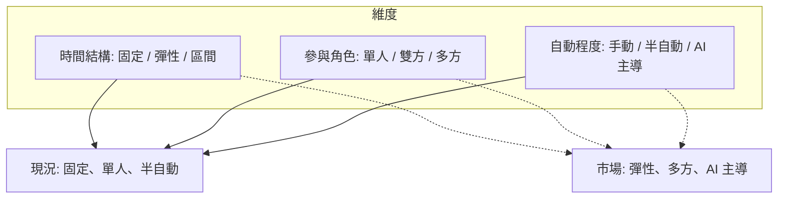

---

## 4. 主題模式與本質對應

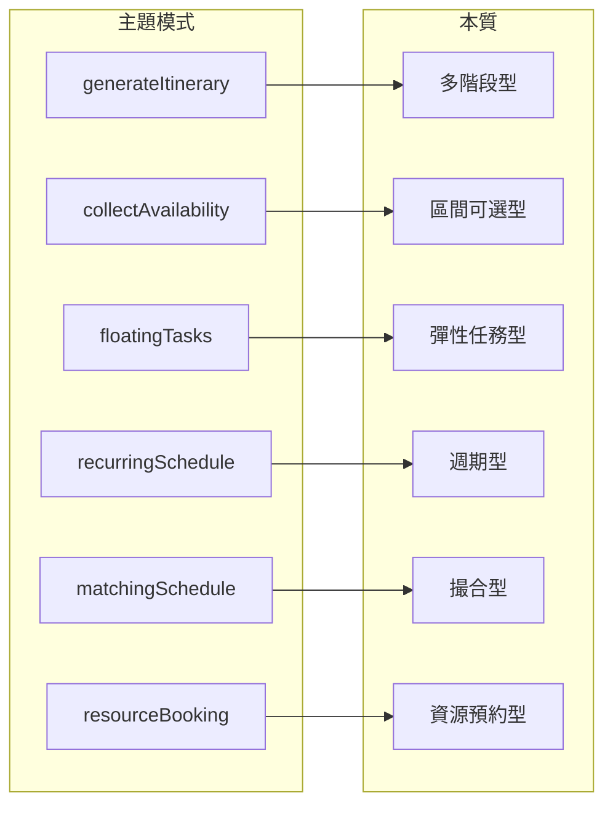

---

## 5. Firestore 資料模型

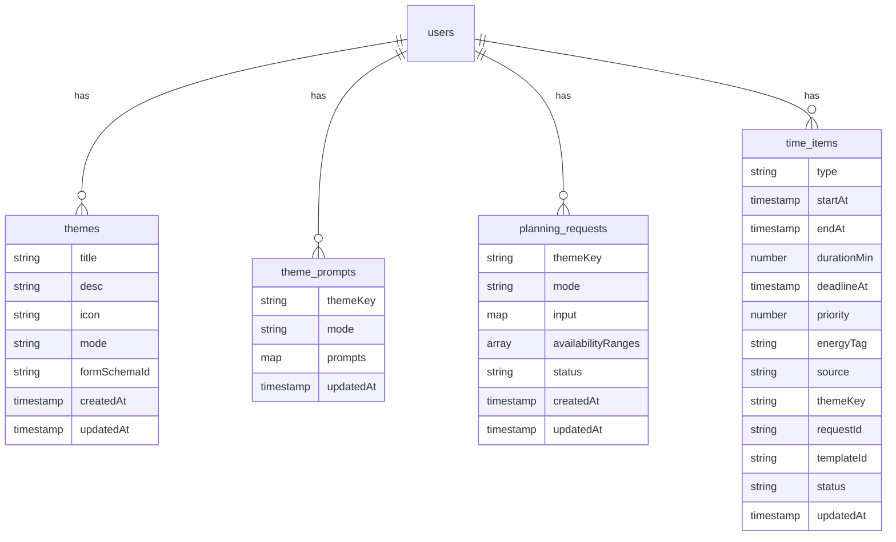

**集合路徑：**

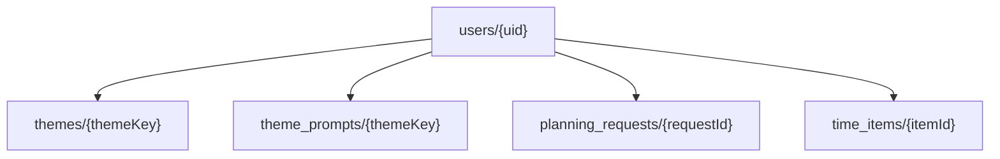

**time_items type 與型態對應：**

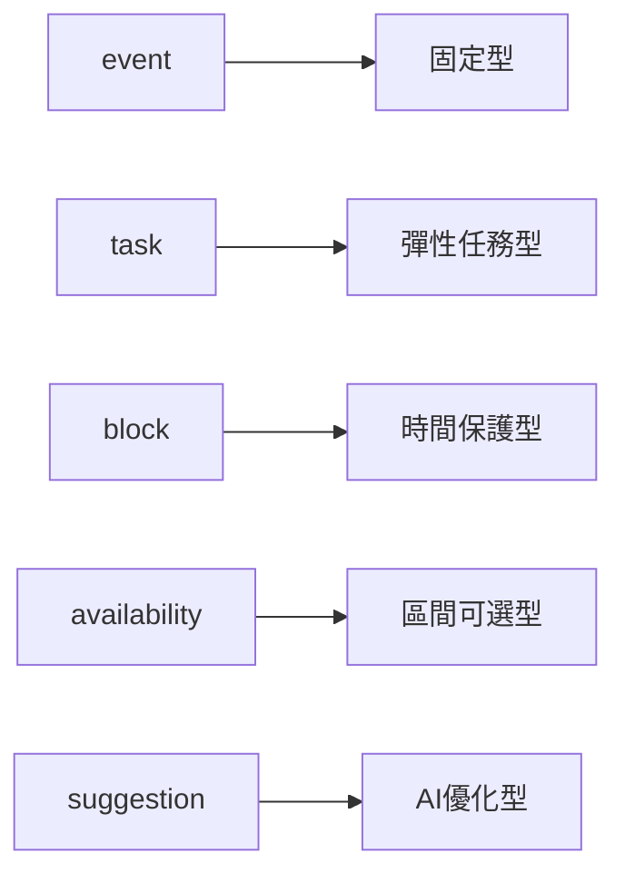

---

## 6. 服務層架構

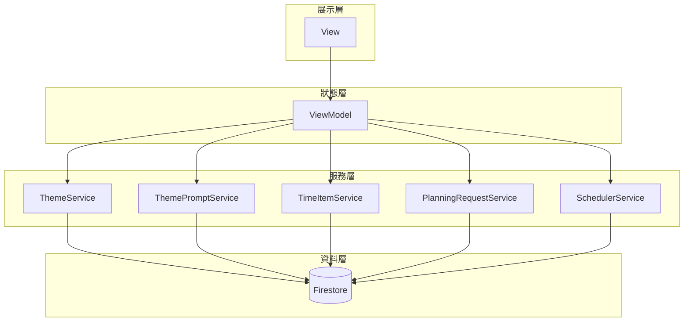

**原則：**

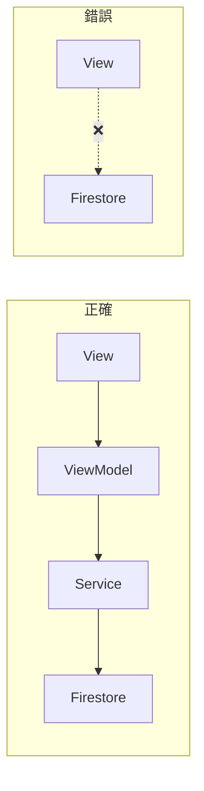

**服務職責：**

| 服務 | 職責 |
|------|------|
| ThemeService | themes CRUD |
| ThemePromptService | promptSet CRUD |
| TimeItemService | time_items CRUD、批次更新、衝突檢測 |
| PlanningRequestService | planning_requests 流程單 |
| SchedulerService | 生成建議排程/調整，不直接寫 UI |

---

## 7. 快取與查詢策略

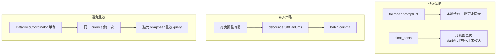

---

## 8. 實作路線圖

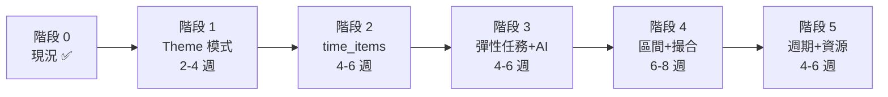

```mermaid
gantt
    title 實作階段時程（示意）
    dateFormat X
    axisFormat %s

    section 階段 1
    Theme 模式擴充    :a1, 0, 4
    section 階段 2
    time_items 統一   :a2, 4, 10
    section 階段 3
    彈性任務 + AI     :a3, 10, 16
    section 階段 4
    區間 + 撮合       :a4, 16, 24
    section 階段 5
    週期 + 資源       :a5, 24, 30
```

---

## 9. 進階時間規劃模式（補充）

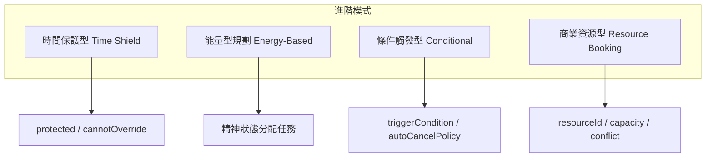

---

## 10. 生成引擎架構

生成引擎為「多階段型」itinerary 的統一管道：UI 只組 `GenerateRequest` 並呼叫 `GenerationOrchestrator`，唯一輸出為 `GenerationResult`；新資料一律寫入 **time_items**（event / suggestion）。

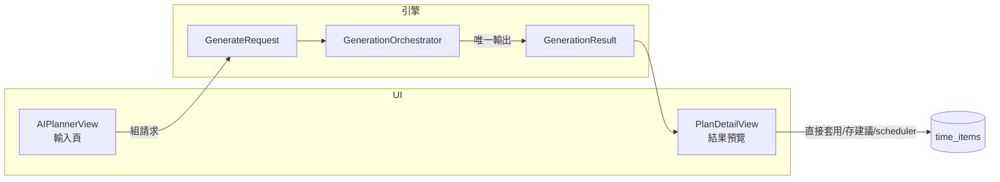

**Orchestrator 內部流程：**

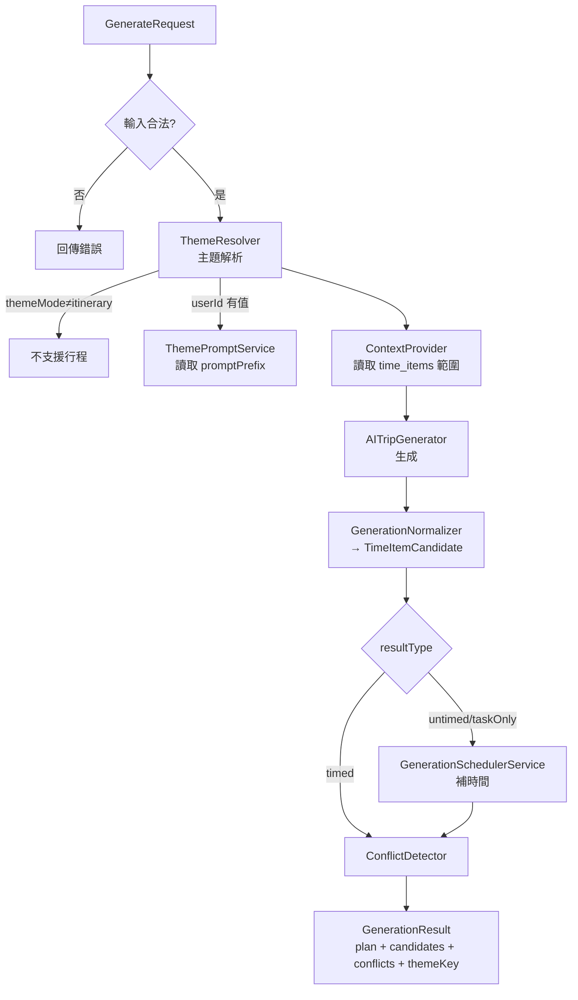

**與服務層對應：**

| 引擎組件 | 依賴服務 / 資料 |
|----------|------------------|
| ThemeResolver | ThemePromptService（theme_prompts）、QuickThemeManager（themeMode） |
| ContextProvider | TimeItemService.fetchFixedItems |
| ApplyStrategy | TimeItemService.upsert（寫入 event / suggestion） |
| ConflictDetector | 現有 time_items（event、block） |
| GenerationSchedulerService | 空檔計算（與 SchedulerService 邏輯一致） |

**原則：**

- 對外唯一輸出為 **GenerationResult**；`PlanResult` 僅為過渡欄位存在於 `result.plan`。
- 新生成結果一律寫入 **time_items**（直接套用 → event，存為建議 → suggestion），不寫入舊 EventManager 為主流程。
- 寫入時帶入 `requestId`、`themeKey`，便於篩選與統計。

---

**對應文件**： [TIME_ENGINE_ARCHITECTURE.md](./TIME_ENGINE_ARCHITECTURE.md)  
**最後更新**： 2025-03-07
