# Secalender 頁面跳轉 — Mermaid 圖

本文件以 Mermaid 圖呈現 App 內所有頁面與跳轉關係，對應 [页面导航树状图.md](./页面导航树状图.md)。

---

## 1. 應用入口與主架構

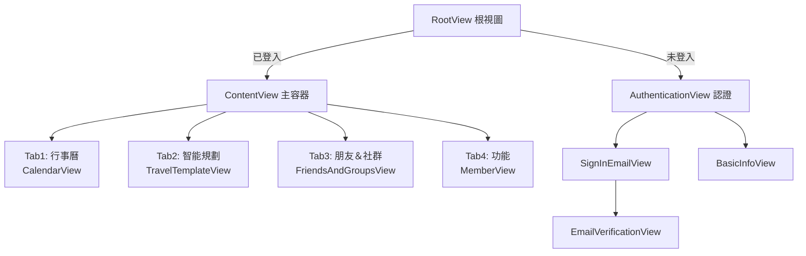

---

## 2. 中間按鈕觸發（ContentView Sheet）

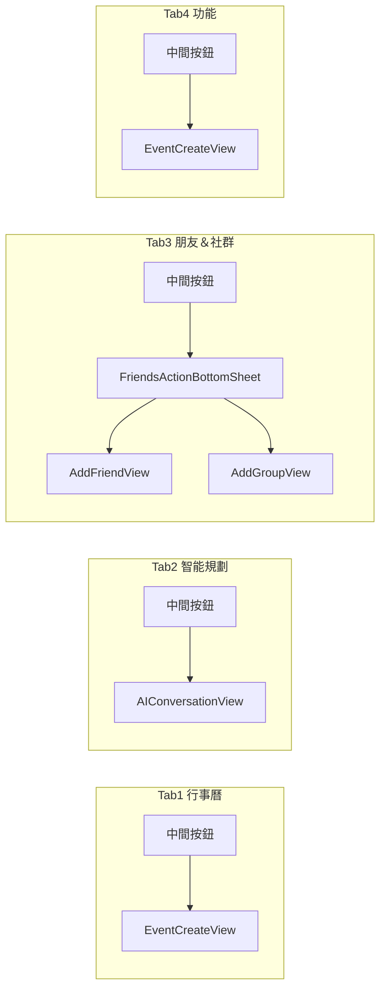

---

## 3. Tab 1 — 行事曆（CalendarView）

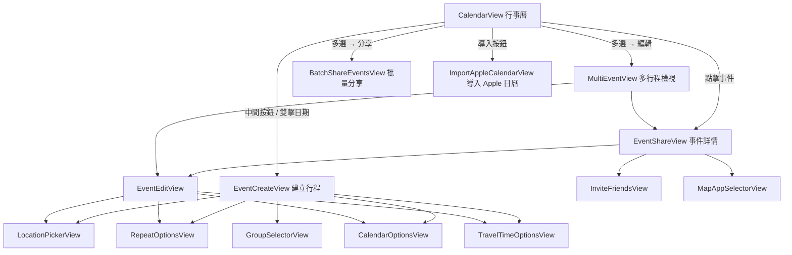

---

## 4. Tab 2 — 智能規劃（TravelTemplateView）

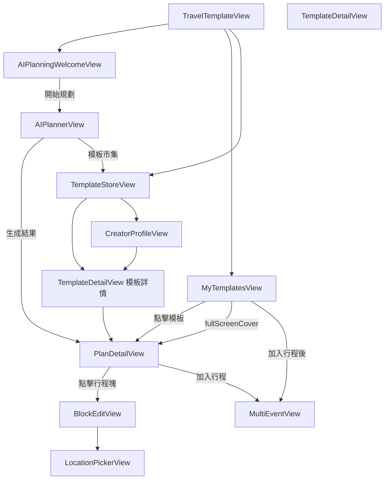

**AIPlanningWelcomeView 主題 Sheet 一覽：**

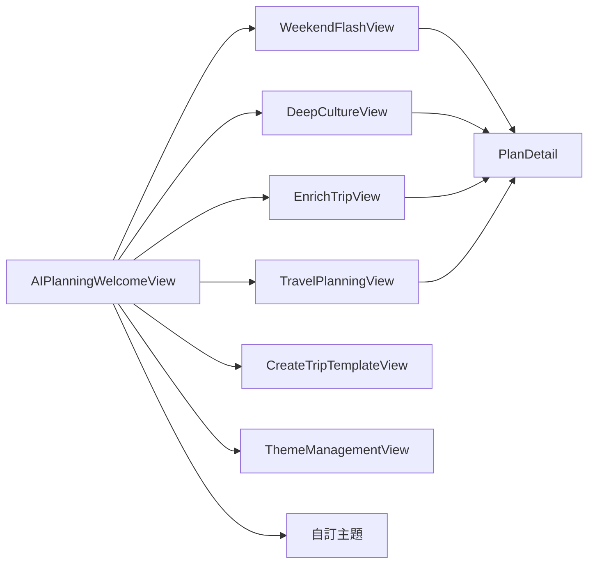

---

## 5. Tab 3 — 朋友＆社群（FriendsAndGroupsView）

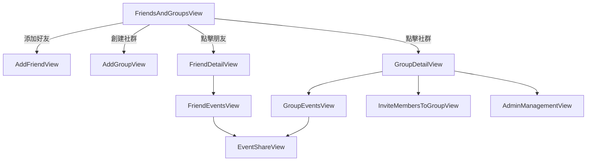

---

## 6. Tab 4 — 功能（MemberView）

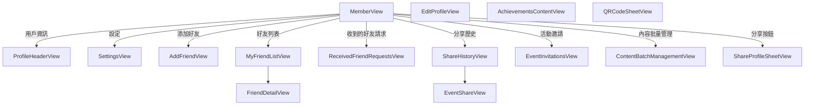

---

## 7. 設定頁（SettingsView）子頁面

```mermaid
flowchart TB
    Settings[SettingsView]
    Settings --> EditProfile[EditProfileView]
    Settings --> AccountSec[AccountSecurityView]
    Settings --> Visibility[VisibilityPrivacyView]
    Settings --> Notif[NotificationsView]
    Settings --> AIPref[AIAssistantPreferencesView]
    Settings --> DarkMode[DarkModeSelectionView]
    Settings --> Lang[LanguageSelectionView]
    Settings --> ContentPref[ContentPreferencesView]
    Settings --> Wallet[WalletPaymentView]
    Settings --> Feedback[FeedbackView]
    Settings --> Cache[CachePerformanceView]
    Settings --> About[AboutView]
    Settings --> Privacy[PrivacyPolicyView]
    AccountSec --> Phone[PhoneBindingView]
    AccountSec --> Pwd[PasswordManageView]
    AccountSec --> RealName[RealNameVerifyPlaceholderView]
    Settings --> ThemePref[ThemePreferencePickerView]
    Settings --> PayPwd[PaymentPasswordPlaceholderView]
    Settings --> Business[BusinessCenterDetailView]
    Settings --> Bills[BillsPlaceholderView]
    Settings -->|登出| AuthenticationView
```

---

## 8. 編輯個人資料（EditProfileView）子頁

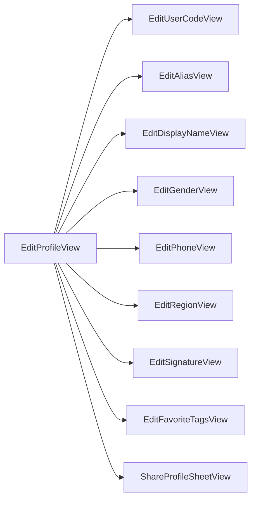

---

## 9. 導航方式圖例

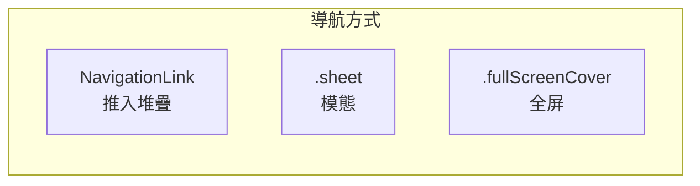

| 方式 | 說明 | 範例 |
|------|------|------|
| NavigationLink | 推入導航堆疊，可返回 | MemberView → SettingsView |
| .sheet | 底部彈出模態 | CalendarView → EventCreateView |
| .fullScreenCover | 全屏覆蓋 | MyTemplatesView → PlanDetailView |

---

## 10. Deep Link 與 RootView Sheet

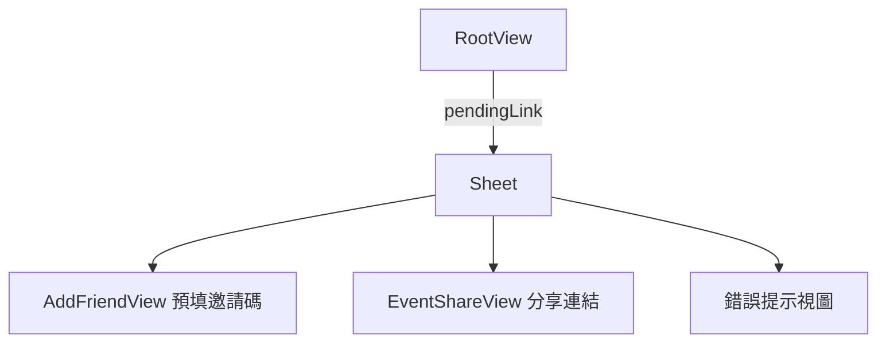

---

## 11. 頁面與檔案對照（精簡）

| 頁面 | 檔案路徑 |
|------|----------|
| RootView | Secalender/Core/RootView.swift |
| ContentView | Secalender/ContentView.swift |
| CalendarView | Secalender/Views/CalendarView.swift |
| TravelTemplateView | Secalender/Views/Template/TravelTemplateView.swift |
| FriendsAndGroupsView | Secalender/Views/FriendsAndGroupsView.swift |
| MemberView | Secalender/Views/Member/MemberView.swift |
| EventCreateView / EventEditView / EventShareView | Secalender/Views/Event*.swift |
| PlanDetailView / BlockEditView / PlanEditView | Secalender/Views/Plan*.swift, BlockEditView.swift |
| AIPlannerView / AIPlanningWelcomeView | Secalender/Views/Template/AIPlannerView.swift, AIPlanningWelcomeView.swift |
| MyTemplatesView / TemplateStoreView / TemplateDetailView | Secalender/Views/Template/*.swift, TemplateDetailView.swift |
| SettingsView 及子頁 | Secalender/Core/Settings/SettingsView.swift |
| EditProfileView 及子頁 | Secalender/Views/EditProfileView.swift |

---

**對應文件**：[页面导航树状图.md](./页面导航树状图.md)  
**最後更新**：2025-03-07
